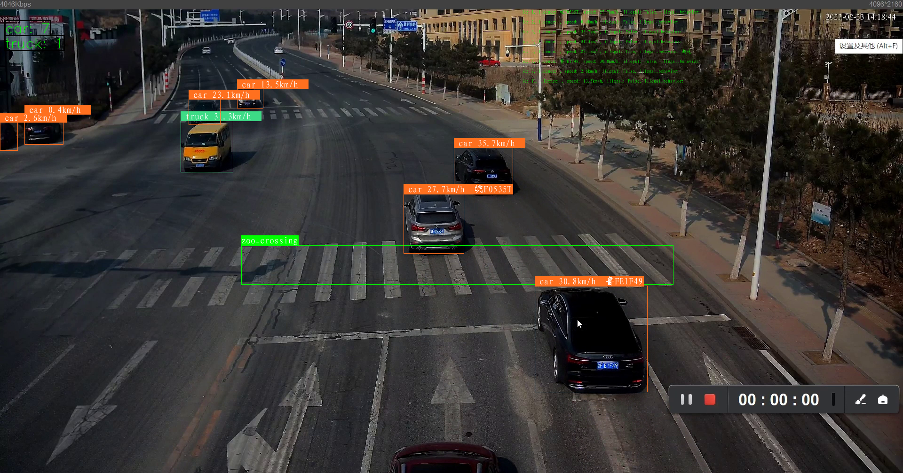
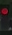

# Yolov9 + StrongSORT Traffic_tracker

## Before you run the tracker

安装依赖库，确保python>3.8 （尽量用3.8版本 不要高版本）

如果没有cuda先去安装cuda

https://blog.csdn.net/chen565884393/article/details/127905428

安装**anaconda** **pytorch**

conda和torch安装: https://blog.csdn.net/MCYZSF/article/details/116525159


最后 在conda终端激活环境后 cd到本目录 
pip install -r requirements.txt -i https://pypi.tuna.tsinghua.edu.cn/simple


## Tracking sources

```bash

$ python detect_v9.py --source 0  # webcam
                           img.jpg  # image
                           vid.mp4  # video
                           path/  # directory
                           path/*.jpg  # glob
                           'https://youtu.be/Zgi9g1ksQHc'  # YouTube
                           'rtsp://example.com/media.mp4'  # RTSP, RTMP, HTTP stream
```


## Select object detection and ReID model

### Yolo

There is a clear trade-off between model inference speed and accuracy. In order to make it possible to fulfill your inference speed/accuracy needs
you can select a Yolov9/7 family model for automatic download

```bash


$ python python detect_v9.py --source 0 --yolo-weights yolov7.pt --img 640
                                            yolov9-c.pt --img 640
                                           
```

### StrongSORT

The above applies to StrongSORT models as well. Choose a ReID model based on your needs from this ReID [model zoo](https://kaiyangzhou.github.io/deep-person-reid/MODEL_ZOO)

```bash


$ python python detect_v9.py --source 0 --strong-sort-weights osnet_x0_25_market1501.pt
                                                   
```


## 选择跟踪类别


```bash
python python detect_v9.py --source 0 --yolo-weights yolov7.pt --classes 0  # tracks persons only
```


## 测速实现
首先使用提前设定好的车辆真实宽度和检测出来的车辆像素宽度求出真实距离和像素距离的比值为c，再使用每辆车的前后两帧框的中心坐标计算出两帧之间移动的像素距离。利用这个比值和像素距离做映射，就可以求出两帧之间车辆移动的真实距离。然后距离除以两帧之间的时间，就是速度了。本测速算法中将车辆真实移动距离与像素移动距离看成是线性关系，仅在监控相机轴线与车辆移动方向垂直时才能成立，并且检测出来的车辆框在空间上会产生一定形变，使得真实距离和像素距离的映射关系不准确。
```bash

def Estimated_speed(outputs, output, id, fps, width):
    SpeedOver = False
    prev_IDs = []  # 之前的ids
    work_IDs = []  # 有效的ids
    work_locations = output  # 当前帧数据：中心点x坐标、中心点y坐标、目标序号、车辆类别、车辆像素宽度
    work_prev_locations = []  # 上一帧数据，数据格式相同
    for i in range(len(outputs)):
        prev_IDs.append(outputs[i][4])  # 获得前一帧中跟踪到车辆的ID

    for m, n in enumerate(prev_IDs):  # 进行筛选，找到在两帧图像中均被检测到的有效车辆ID，存入work_IDs中
        if id == n:
            work_IDs.append(m)
            work_prev_locations = outputs[m]  # 将当前帧有效检测车辆的信息存入work_locations中


    if len(work_IDs) > 0:
        locations = [0,0]
        prev_locations = [0,0]  # 存放中心点坐标
        bbox_prev = work_prev_locations[0:4]
        bbox = work_locations[0:4]
        p1, p2 = (int(bbox_prev[0]), int(bbox_prev[1])), (int(bbox_prev[2]), int(bbox_prev[3]))
        print(p1)
        prev_locations[0] = (p2[0] - p1[0]) / 2 + p1[0]
        prev_locations[1] = (p2[1] - p1[1]) / 2 + p1[1]
        x1, x2 = (int(bbox[0]), int(bbox[1])), (int(bbox[2]), int(bbox[3]))
        locations[0] = (x2[0] - x1[0]) / 2 + x1[0]
        locations[1] = (x2[1] - x1[1]) / 2 + x1[1]
        d=math.sqrt((locations[0] - prev_locations[0]) ** 2 + (locations[1] - prev_locations[1]) ** 2)

        speed = ((d /width ) *2.5*3.6* fps  )  #像素速度

        if speed > 60:
            SpeedOver = True

        print(speed)
        # speed = 11.3
        speed = str(round(speed, 1)) + "km/h"
        return speed,SpeedOver
    return " ",SpeedOver
```
## 车牌识别
通过**MTCNN**定位车牌目标位置 **LPRNET**对车牌字符进行识别 目标识别对监控画质要求高 因数据集问题 目前无法识别绿牌

## 前端调用
前端至少需要能调用视频（由一帧帧图片组成）以及字典 和 列表

## 追踪
```bash
$ python detect_v9.py --source .....
```
目前可以通过yolov9进行检测，速度会比yolov7要更高，且检测精度更好,目前模型用的官方**yolov9-c.pt** 模型，数据集为coco

## 待实现
此算法检测的速度不准确 低于正常速度 还需通过**单目测距** 
yolov9数据集制作以及算法改进

## 2024/3/30
**车牌检测线程**

**图片显示线程**

**斑马线检测线程**

增加后处理时间：


增加前处理时间：



## 前端要注意的点
**车辆截图保存**
目前所有图片都保存在后端，因此前端要考虑如何从后端读入相关保存的图片，或者提供一个网络上传接口，实时将后端图片进行上传至前端

**实时车流统计**
目前车流统计是通过字典格式保存 格式{类别：数量}
前端需要实时读入 并实时绘制相应统计图

**实时图片**
前端可直接读入self.image_display_queue此队列里的图片进行显示

## 设想
高清摄像头 可以适配 人脸检测（应用于违规抓拍后的识别） 驾驶员行为检测（玩手机 喝水等等）  可以在主界面跳转两个系统 应用在不同摄像头以及道路上 更具有实际意义

## 2024/4/3 
update:
更新车牌检测模型位yolov8
更改线程处理方式 修复并发线程无法及时检测车牌的问题

## 2024/4/4

在运行代码中 使用self.is_running 指示运行状态 方便调整

同时新增det_thread 通过线程启动检测，可以在主线程中添加更多的处理细节 比如获取车辆信息表等

